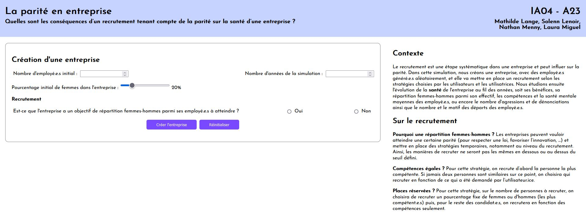
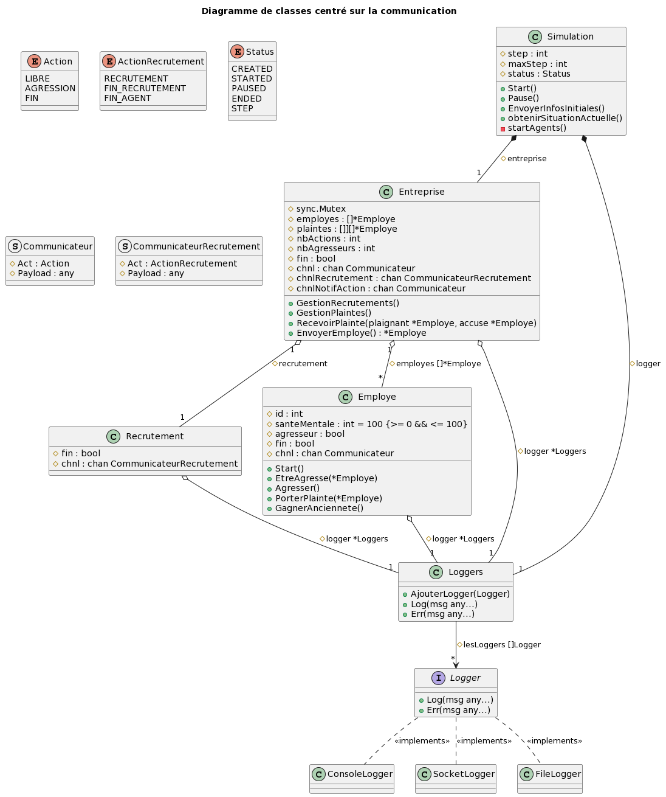

# La parité en entreprise (Compléments)

Dans ce document se trouvent des informations supplémentaires sur le projet : comment il a été modélisé et quels sont nos choix, quelle est son architecture, ...

## La table des matières

* [L'interface de simulation](#linterface-de-simulation)
    * [Le formulaire](#le-formulaire)
        * [Pourquoi un pourcentage de femmes à atteindre ?](#pourquoi-un-pourcentage-de-femmes-à-atteindre)
        * [Places réservées ?](#places-réservées)
        * [Compétences égales ?](#compétences-égales)
    * [La simulation](#la-simulation)
    * [Fonctionnement de l'interface](#fonctionnement-de-linterface)
* [La modélisation](#la-modélisation)
    * [Ce qui est modélisé et les sources](#ce-qui-est-modélisé-et-les-sources)
        * [Employé](#employé)
        * [Recrutement](#recrutement)
        * [Agressions, plaintes et licenciement](#agressions-plaintes-et-licenciement)
        * [Départs (hors licenciement)](#départs-hors-licenciement)
        * [Congés maternité](#congés-maternité)
        * [Formation](#formation)
        * [Team building](#team-building)
        * [Bénéfices](#bénéfices)
    * [L'exprimer dans le code](#lexprimer-dans-le-code)
        * [Simulation](#simulation)
        * [_Entreprise_](#entreprise)
        * [_Employé_](#code-employé)
        * [_Recrutement_](#recrutement-1)
* [Les résultats](#les-résultats)
* [Non pris en compte dans notre modélisation](#pas-pris-en-compte)
    * [La rédaction de l'annonce](#la-rédaction-de-lannonce)
    * [La présentation de l'entreprise](#la-présentation-de-lentreprise)
    * [L'anonymisation des candidatures](#lanonymisation-des-candidatures)
    * [Les entretiens](#les-entretiens)
    * [Les avantages au sein de l'entreprise](#les-avantages-au-sein-de-lentreprise)
    * [Les mesures anti-VSS](#les-mesures-anti-vss)
    * [Les VSS](#les-vss)
    * [L'intervention du/de la psychologue d'entreprise](#lintervention-dude-la-psychologue-dentreprise)
    * [Les causes de départs](#les-causes-de-départs)
    * [Les différences de salaire](#les-différences-de-salaire)
    * [Le secteur](#le-secteur)
    * [Pourquoi nous n'avons pas utilisé l'index de l’égalité professionnelle entre les femmes et les hommes ?](#pourquoi-nous-navons-pas-utilisé-lindex-de-légalité-professionnelle-entre-les-femmes-et-les-hommes)
* [Remarques sur la simulation actuelle](#remarques-sur-la-simulation-actuelle)
    * [Sur l'interface](#sur-linterface)
    * [Sur la modélisation](#sur-la-modélisation)
* [Annexes](#annexes)

## L'interface de simulation

### Le formulaire

Nous avons en premier temps un formulaire dans lequel l'utilisateur·ice entre les informations mentionnées ci-dessous. Il y a également des informations sur la simulation qui correspondent à la partie [Le sujet](#le-sujet) et cette partie.

L'utilisateur·ice va pouvoir définir :
* le nombre d'employé·e·s de l'entreprise,
* la durée de la simulation (un pas de la simulation correspond à une année dans l'entreprise),
* le pourcentage initial de femmes dans l'entreprise,
* s'iel a un pourcentage de femmes à atteindre,
* le type de recrutement (s'iel a certaine répartition femmes-hommes à atteindre, il faut choisir un type de recrutement pour quand on est en dessous de ce pourcentage, et un type de recrutement pour quand on est au-dessus du pourcentage).

#### Pourquoi un pourcentage de femmes à atteindre ?
Les entreprises peuvent vouloir atteindre une certaine répartition femmes-hommes (pour respecter une loi, favoriser l’innovation, etc.) et mettre en place des stratégies temporaires, notamment au niveau du recrutement. Ainsi, les manières de recruter ne seront pas les mêmes en dessous ou au-dessus du seuil défini.

#### Places réservées ?
Pour cette stratégie, sur le nombre de personnes à recruter, on choisira de recruter un pourcentage fixe de femmes ou d'hommes (on prendra toujours les plus compétent·e·s dans cette population) puis, pour le reste des candidat·e·s, on recrutera en fonction des compétences seulement. Cette stratégie n'existe pas dans la réalité puisqu'il s'agit d'une discrimination de genre. En effet, on ne peut discriminer à l'embauche sur le genre que pour des cas particuliers, comme pour le cinéma ou mannequinat[1](https://analyseur.acompetenceegale.com/comment-eviter-discriminations-a-lembauche-selon-sexe/).

#### Compétences égales ?
Pour cette stratégie, on recrute d’abord la personne la plus compétente. Si jamais deux personnes ont des compétences équivalentes, on choisira qui recruter en fonction de ce qui a été demandé par l’utilisateur·ice : iel choisit s'iel donne sa préférence à une femme, à un homme, ou s'iel n'a pas de préférence et prend un·e des candidat·e·s au hasard. C'est un type de recrutement qu'on peut appliquer à la vie réelle, mais uniquement en cas de candidatures comparables, en faveur du genre sous-représenté et en cas de dernier critère de départage[2](https://egaliteautravail.com/domaine/recrutement/).

### La simulation

La validation du formulaire nous renvoie sur la page de simulation. Nous pouvons alors la lancer (soit de façon à ce que les pas s'enchaînent sans action de l'utilisateur·ice, soit en avançant pas à pas). On peut également arrêter la simulation, la mettre en pause et revenir au formulaire.
Quand la simulation est lancée, on peut voir depuis combien d'années l'entreprise tourne sous la simulation, le nombre d'employé·e·s, la parité, les bénéfices. En particulier, on a des graphes nous montrant l'évolution, au cours des années, des bénéfices, de la parité, des compétences des employé·e·s et de la santé mentale des employé·e·s.
Dans une partie *Tableau de bord*, on peut voir des informations sur ce qu'il se passe au cours des années. Ces informations sont divisées en catégories (on peut sélectionner les catégories qu'on souhaite voir dans le tableau de bord) :
* Agression : le nombre d'agressions entre employé·e·s et le nombre de signalements faits auprès de l'entreprise ;
* Départ : le nombre de démissions (spontanées, dûe à une dépression ou après un congé maternité), le nombre de retraites, le nombre de licenciements ;
* Entreprise : si l'entreprise reçoit des amendes liées à sa parité, ou un bonus de productivité ;
* Recrutement : le nombre d'embauches et des détails sur le comportement des ressources humaines pendant le processus de recrutement ;
* Employé : le nombre de naissances d'enfants et de congés parentaux ;
* Événements : l'organisation de team building et le nombre d'employé·e·s ayant participé à une formation.
On a également des informations au survol sur le bénéfice, le recrutement et les catégories pour avoir des explications supplémentaires.

### Fonctionnement de l'interface

L'interface a été réalisée en HTML/CSS/JavaScript. Nous utilisons la bibliothèque Chart.js pour créer les graphes et visualiser les données au cours du temps. Pour envoyer les informations issues du formulaire et créer une nouvelle simulation, nous utilisons une requête POST. Les informations envoyées et retournées peuvent être consultées dans le document [API.md](API.md).

Une fois sur la page de la simulation, toutes les informations sont transférées grâce à des websockets. Les données sont de différents types et envoyées à différents moments. Nous utilisons un Logger qui envoie les données dans les websockets, en même temps qu'il les affiche dans la console. Ce Logger est commun à la simulation et à tous les agents (employé·e·s, recrutement et entreprise). Nous avons séparé les différents types de log avec des constantes dans le code pour pouvoir les différencier les uns des autres.

D'abord, les informations "initiales" qui concernent la simulation créée (l'id de la simulation, le nombre d'années, le type de recrutement choisi, status de la simulation...) sont envoyées à la page HTML dès qu'une connexion websocket est établie. Cela permet à la simulation de n'être pas dépendante d'une page web particulière. Ainsi, on peut toujours retrouver les informations lorsqu'on reload une page web avec l'id de la simulation. Dans le code, ces informations sont regroupés sous la constante "LOG_INITIAL".

Nous gérons également des informations sur le status de la simulation, par exemple si elle est terminée, à relancer, en pause, pour afficher ces informations sur l'interface avec des popup temporaires. Ce sont des "LOG_REPONSE". 

Ensuite, pour afficher les informations au fur et à mesure, la simulation envoie chaque année son pas de temps actuel, son nombre d'employé·e·s, son pourcentage de femmes, son bénéfice, la moyenne des compétences et la moyenne de la santé mentale. Cela correspond aux informations globales, "LOG_GLOBAL". 

Enfin, pour suivre le déroulé de la simulation, chaque agent (que ce soit des employé·e·s, le recrutement ou l'entreprise) transmet les informations à l'interface lorsqu'il agit. Cela permet de garder les informations sur les actions au moment où elles sont réalisées. Ces logs sont catégorisés pour pouvoir être affichés de différentes couleurs dans l'interface et masqués si besoin. L'entreprise peut envoyer les logs suivants : LOG_AGRESSION, LOG_DEPART, LOG_ENTREPRISE, LOG_EVENEMENT. Le recrutement envoie les LOG_RECRUTEMENT et les employé·e·s LOG_EMPLOYE.

## La modélisation

### Ce qui est modélisé et les sources

#### Employé
À la création de l'entreprise, le genre des employé·e·s est attribué de façon à respecter la répartition homme-femme sélectionnée par l'utilisateur·ice. Par la suite, les candidat·e·s généré·e·s auront une probabilité égale d'être un homme ou une femme.

Les compétences d'un·e employé·e sont modélisées par un entier entre 0 à 10. Elles suivent une loi normale avec mu=5 et sigma=3. Cela permet d'obtenir une majorité d'individus moyens et assez peu d'individus excellents ou mauvais[3](https://www.ruf.rice.edu/~lane/papers/male_female.pdf).

Pour la santé mentale, nous avons décidé de la modéliser comme un entier de 0 à 100. Au moment de rejoindre l'entreprise, iel dispose d'une santé mentale pleine, soit de 100. Son expérience au sein de l'entreprise peut augmenter ou réduire sa santé mentale dans le domaine défini.

Concernant l'ancienneté, il s'agit d'un entier entre 0 et 43. Les employé·e·s généré·e·s au début de la modélisation ont une ancienneté aléatoire. Les nouveaux·elles employé·e·s ont une ancienneté de 0 (on considère qu'uniquement des jeunes diplômé·e·s sont recruté.e.s). Cette valeur est incrémentée tous les ans. Lorsqu'un·e employé·e a une ancienneté de 43 (nombre de trimestres nécessaires pour avoir une retraite à taux plein[4](https://www.service-public.fr/particuliers/vosdroits/F35063)), iel part à la retraite.

Enfin, pour modéliser les agressions sexuelles au travail, il était nécessaire de déterminer les employé·e·s susceptibles d'agresser leurs collègues. Or, il n'existe pas de statistiques fournissant le pourcentage d'agresseur·euse·s parmi la population. Pour représenter cela, nous avons utilisé les statistiques suivantes : 12% des femmes et 2% des hommes sont victimes de harcèlement sexuel par an d'après une étude de l'INED en 2018 (https://www.harcelement.eu/les-statistiques-choquantes-sur-le-harcelement-sexuel-au-travail-en-france/). Nous avons réalisé des hypothèses très réductrices. Nous utilisons ces statistiques sur le harcèlement sexuel comme des statistiques sur les agressions sexuelles. Il s'agit d'une simplification car le harcèlement sexuel correspond à des agressions sexuelles répétées sur la même personne. Nous supposons ensuite que les femmes sont agressées uniquement par des hommes, tous différents et inversement pour les hommes. Or, la proportion homme-femme dans la population est équivalente. Par conséquent, on considère que 12% des hommes et 2% des femmes sont des agresseur·euse·s. Nous avons conscience qu'en réalité les agressions sont souvent réalisées par les mêmes individus et que ces chiffres sont surévalués. Nous les avons conservé par faute de trouver d'autres sources plus pertinentes.

#### Recrutement
Pour le recrutement, nous avons considéré que l'entreprise cherche à s'étendre tous les ans. Elle veut s'agrandir de 5% de son effectif. Cette valeur a été choisie pour s'assurer d'un recrutement assez conséquent afin d'étudier la question du projet. 
Pour chaque poste ouvert, 18 candidat·e·s postulent d'après les chiffres d'automne 2022 de notre source [5](https://blog.flatchr.io/barometre-des-entreprises-qui-recrutent-deuxieme-semestre-2022). Les détails du recrutement seront décrits dans la partie suivante [L'exprimer dans le code](#lexprimer-dans-le-code).

#### Agressions, plaintes et licenciement
Chaque employé·e identifié·e comme un·e agresseur·euse agresse tous les ans une fois. Iel agresse quelqu'un du genre opposé sauf si l'entreprise ne contient que des employé·e·s de même genre. Iel ne s'agresse pas lui-même. Par sécurité, nous avons déterminé que si l'agresseur.euse ne parvient pas à trouver une personne à agresser après 4 essais, alors iel n'agresse pas. 
Les personnes agressées voient leur santé mentale diminuer de 20 (sur 100 lorsqu'elle est au maximum). Cette valeur a été déterminée arbitrairement car l'impact d'une agression sexuelle n'est pas quantifiable. Une victime informe l'entreprise de l'agression dans 30% des cas [6](https://juridique.defenseurdesdroits.fr/doc_num.php?explnum_id=20252). Cette source explique aussi que 35% des signalements se sont conclus "au détriment de l'auteur" mais que "celui-ci n'a pas finalement pas été sanctionné" dans la moitié de ces cas. Nous faisons donc l'hypothèse qu'en cas de licenciement, un·e agresseur·euse est licencié·e dans 17.5% des cas (35/2).

#### Départs (hors licenciement)
En dehors du licenciement, les employé·e·s peuvent quitter l'entreprise pour plusieurs raisons :
- Dépression (si santéMentale = 0)
- Retraite (si ancienneté = 43)
- Démission spontanée

Un·e employé·e a 2.7% de chance de démissionner de l'entreprise (source : *Dares*, 1er trimestre 2022 [7](https://dares.travail-emploi.gouv.fr/publication/la-france-vit-elle-une-grande-demission)).
Cependant, la présence de femmes au sein d'une entreprise a tendance à augmenter la rétention des employé·e·s. D'après *Catalyst* [8](https://effet-a.com/dossier-equite/5-bonnes-raisons-dengager-plus-de-femmes/), 20% de l'intérêt des employé·e·s à rester dans une entreprise correspond à un sentiment d'inclusion. Par conséquent, nous faisons l'hypothèse qu'en présence d'un nombre de femmes suffisants, les employé·e·s ont 20% moins de chance de démissionner. Pour déterminer ce pourcentage de femmes seuil, nous nous sommes appuyé sur les travaux de Rosabeth Kanter décrits dans une étude [9](https://www.cairn.info/revue-travail-genre-et-societes-2010-1-page-181.htm). Elle considère qu'il faut qu'une minorité représente au moins 35% de l'effectif d'une organisation pour qu'elle ait un impact sur cette dernière. Ainsi, nous réduisons de 20% le pourcentage de chance de démission si les femmes représentent au moins 35% de l'effectif de l'entreprise.
- Démission après congé maternité 

3 femmes sur 10 changent d'employeur après un congé maternité [10](https://www.gereso.com/actualites/2022/12/22/apres-conge-maternite-risque-demission/). Nous modélisons donc que 30% des femmes posent leur démission après leur congé maternité. Nous n'avons pas trouvé de chiffres équivalents pour les hommes donc nous considérons qu'ils ne démissionnent pas après leurs congés paternité.

#### Congés maternité
Aucune source fournissant le nombre de naissances par an au sein d'une entreprise n'a été trouvée. Par conséquent, nous avons utilisé l'indice de natalité français [11](https://data.worldbank.org/indicator/SP.DYN.TFRT.IN?end=2021&start=2021&view=bar) indiquant qu'en moyenne un individu a 1.83 enfant en France. Puis, nous avons considéré qu'une femme a un enfant entre 20 et 60 ans donc qu'elle dispose de 40 ans pour avoir 1.83 enfant. Ainsi, nous considérons qu'un·e employé·e a une probabilité de 0.04575 d'avoir un enfant au sein de son foyer par an. Nous n'avons pas placé de limites sur le nombre d'enfants qu'un·e employé·e peut avoir.
Le congé de maternité est obligatoire [12](https://www.service-public.fr/particuliers/vosdroits/F2265/personnalisation/resultat?lang=&quest0=0&quest1=0&quest=) donc toutes les femmes ayant un enfant partent en congé maternité. Les hommes ont 71% de chance de partir en congé maternité (chiffre issu d'une étude de la *Drees* en 2021 [13](https://www.lefigaro.fr/social/de-plus-en-plus-de-peres-prennent-leur-conge-paternite-mais-des-inegalites-demeurent-20230720).
Pour simplifier la modélisation, nous considérons que toute personne partant en congé maternité part pendant la durée maximale du congé maternité (ce qui s'éloigne de la réalité). Un congé maternité peut durer jusqu'à 4 mois et un congé paternité jusqu'à 1 mois [14](https://www.capital.fr/votre-carriere/conge-parental-1323770). 
Le remplacement de l'employé·e en congé parental n'a pas été modélisé.

#### Formation
Pour augmenter les compétences des employé·e·s, nous avons décidé de modéliser des formations annuelles auxquelles participent 32% des employé·e·s choisi·e·s aléatoirement mais de façon à ce que 50% des participant·e·s soient des femmes [15](https://modelesdebusinessplan.com/blogs/infos/marche-formation-professionnelle). Nous avons considéré arbitrairement qu'au bout de 5 formations suivies, un·e employé·e gagne un point de compétence.

#### Team building
Pour que les employé·e·s puissent gagner en santé mentale, nous avons décidé de modéliser des team building. L'entreprise en organise 2 par an, tous les employé·e·s y participent et gagnent 1 point en santé mentale (valeur arbitraire).

#### Bénéfices
La valeur de bénéfice affichée par la simulation correspond à l'argent généré par l'entreprise à la fin de l'année. Ainsi, cela correspond au chiffre d'affaire de l'entreprise soustrait à ses dépenses. 

Nous voulons que le chiffre d'affaire dépende de la santé mentale et des compétences des employé·e·s. Pour calculer ce que rapporte un·e employé·e de l'entreprise modélisé par an, nous utilisons la formule suivante :

*apportEmployé = ChiffreAffaireEmployé x santéMentaleEmployé/100 x compétenceEmployé/5 - coûtEmployé*

La valeur de santé mentale de l'employé·e est divisée par 100 afin que si la santé mentale n'est pas pleine, elle réduit la productivité de l'employé·e. De même, la compétence de l'employé·e est divisée par 5 car un·e employé·e moyen a une compétence de 5.

Le chiffre d'affaire par salarié·e dépend de plusieurs facteurs, comme la taille de l'entreprise ou son secteur. Nous avons modélisé une entreprise très générale, sans définir de secteur spécifique donc nous ne prenons pas cela en compte. Nous pouvons toutefois nuancer la valeur du chiffre d'affaire par employé·e en fonction de la taille de l'entreprise [16](https://letowski.fr/quelques-grands-indicateurs-par-tranche-de-taille-dentreprise/).

Pour déterminer le coût d'un employé·e, nous avons utilisé le simulateur de l'Urssaf[17](https://mon-entreprise.urssaf.fr/simulateurs/salaire-brut-net) à partir du salaire médian en France (2100€ net par mois [18](https://www.lavoixdunord.fr/1385688/article/2023-10-16/quel-est-le-salaire-median-des-francais-en-2023)).

Pendant la durée de leur congé parental, les employé·e·s concerné·e·s ne rapportent rien à l'entreprise mais ne leur coûte aussi rien car c'est la sécurité sociale qui prend en charge leur salaire.

D'après une étude [19](https://www.cairn.info/revue-travail-genre-et-societes-2010-1-page-181.htm), si le pourcentage de femmes au sein d'une entreprise dépasse 35%, le bénéfice généré est supérieur de 28.49%. La valeur calculée du bénéfice prend en compte cela.

À l'inverse, si une entreprise ne respecte pas la loi Rixain sur la parité, elle se voit recevoir une amende d'1% de sa masse salariale [20](https://www.fntp.fr/infodoc/travail-protection-sociale/relations-individuelles-de-travail/execution-du-contrat/loi). La loi Rixain demande 30% de femmes cadres dirigeantes à partir de 2026 et 40% à partir de 2029. Comme nous n'avons pas de différences hiérarchiques entre les employé·e·s, nous décidons d'appliquer une amende si le pourcentage de femmes est inférieure à 40%. De plus, comme nous ne modélisons pas les salaires, l'amende est d'1% du chiffre d'affaire.

Enfin, nous déduisons du bénéfice le coût de fonctionnement de l'entreprise. Cela inclut le coût du recrutement qu'on estime à 6500 euros par poste [21](https://factorial.fr/blog/vrai-cout-dun-recrutement). Le coût des team building est aussi pris en compte [22](https://blog.funbooker.com/budget-team-building/) ainsi que le coût des formations. Une formation coûte en moyenne 500€ par jour par personne [23](https://www.cnfce.com/faq/formation-professionnelle/prix-formation-professionnelle). Elles sont financées à 45% par les entreprise et qu'elle dure en moyenne 46 heures soit 7 jours si on considère un régime de 35h par semaine [24](https://edusign.com/fr/blog/20-chiffres-cles-sur-la-formation-professionnelle/). Ces données nous permettent de modéliser le coût des formations pour l'entreprise : 
*nbEmployesFormes x 500 x 7 x 0.45*.

### L'exprimer dans le code

[Voir partie Annexes pour le diagramme de classe](#diagramme-de-classe)

#### Simulation
Cette classe gère la simulation et en particulier le lien entre le front et la back.

**A FAIRE parler en particulier de la gestion de la communication**

#### _Entreprise_
L'_Entreprise_ est un agent qui assume aussi le rôle de l'environnement puisqu'elle gère les différents agents et c'est elle qui centralise les informations.

Lorsqu'on démarre l'_Entreprise_, elle démarre les _Employés_ et le _Recrutement_, et elle entre dans une boucle dont la durée est déterminée par le nombre de pas de temps de la simulation (et donc le nombre d'années de vie de l'_Entreprise_). Au début de la boucle, l'_Entreprise_ attend un message sur le channel le liant à la simulation. Le message est soit `LIBRE` et ce qui indique à l'_Entreprise_ de lancer une année (ce qui revient à lancer la méthode `agir`), soit `FIN` et ce qui lui indique d'arrêter tous les agents qu'elle a lancé. Si le nombre d'_Employés_ atteint zéro avant la fin de la simulation, on passe tous les pas de temps sans rien faire jusqu'à la fin. Quand l'_Entreprise_ sort de la boucle, elle attend un message final de la simulation pour confirmer l'arrêt.

Quand elle lance une année, l'_Entreprise_ :
* organise les formations ;
* organise un team building ;
* lance les recrutements en envoyant un message à l'agent _Recrutement_ avec le nombre d'_Employés_ à recruter (le _Recrutement_ a un channel dédié à la communication _Entreprise_->_Recrutement_) ;
* envoie un message aux _Employés_ pour leur dire d'agir (chaque _Employé_ a un channel dédié à la communication _Entreprise_->_Employé_).
L'_Entreprise_ attend un message de chacun des _Employés_ (_Entreprise_ a un channel dédié aux retours des _Employés_) pour lancer la fin d'année. Pour attendre les _Employés_, l'_Entreprise_ a une fonction `RecevoirActions` qui prend le nombre d'actions à recevoir en entrée, lance une boucle dans laquelle elle attend un message sur son channel et incrémente un compteur à chaque fois qu'elle reçoit un message. Quand le compteur atteint le nombre d'actions passé en entrée, c'est la fin de la boucle.
En fin d'année, l'_Entreprise_ lance un team building, et lance la fin d'année, elle gère :
* les plaintes (donc licencie éventuellement des _Employés_) ;
* les départs ;
* les recrutements : elle attend un message du _Recrutement_ qui l'informe de la fin du processus de _Recrutement_ (_Entreprise_ a un channel dédié aux retours du _Recrutement_), puis démarre les nouveaux _Employés_.

Pour arrêter tous les agents, l'_Entreprise_ envoie un message de fin sur les channels des _Employés_ et sur le channel du _Recrutement_. Elle doit attendre leurs retours avant de s'arrêter elle-même.

Au cours des actions des _Employés_, ceux-ci peuvent changer les listes des _Employés_ démissionnaires, la liste des départs, la liste des plaintes, le nombre de dépressions et le nombre de congés parentaux : pour éviter des problèmes d'accès concurrents, les fonctions gérant ces changements posent un `Lock` sur l'_Entreprise_.

#### _Employé_
Les _Employés_ sont des agents lancés par l'_Entreprise_.

Quand ils sont lancés, ils entrent dans une boucle dans laquelle ils effectuent leurs actions jusqu'à ce qu'ils aient été arrêtés par l'_Entreprise_.
Pour agir, les _Employés_ attendent un message de l'_Entreprise_ sur un channel dédié (voir [Diagramme de séquence de la vie des employés](#diagramme-de-séquence-de-la-vie-des-employés) pour l'enchaînement des actions). Si l'_Entreprise_ leur envoie le message `LIBRE`, ils vont :
* agresser s'ils sont agresseurs ;
* se former s'ils sont dans la liste des _Employés_ recevant une formation pendant l'année en cours ;
* vieillir ;
* potentiellement avoir un enfant et donc potentiellement partir en congé paternité et potentiellement démissionner après un congé maternité ;
* partir à la retraite s'ils ont assez d'ancienneté ;
* potentiellement poser une démission spontanée.
À chaque action, ils vont modifier des informations centralisées par l'_Entreprise_, donc pour se faire, ils appellent des méthodes de l'_Entreprise_.
Si le message reçu par l'_Employé_ de la part de l'_Entreprise_ est `AGRESSION`, cela signifie que l'_Employé_ se fait agresser. Il va donc perdre de la santé mentale et potentiellement porter plainte auprès de l'_Entreprise_ et partir en dépression.
Si le message est `FIN`, l'_Employé_ passe son attribut fin à `true` ce qui lui permettra de sortir de la boucle de vie.
Enfin, l'_Employé_ envoie un message à l'_Entreprise_ sur un channel pour l'informer qu'il a fini ses actions.

#### _Recrutement_
Le _Recrutement_ est un agent unique créé par la simulation et que l'_Entreprise_ démarre.
Il attend un message de l'_Entreprise_ qui intervient à chaque pas de temps.

Si le message est `Recrutement` alors il peut désormais commencer le _Recrutement_.
Un message de type `Recrutement` est accompagné du nombre de postes à pourvoir. 
Il génère donc un nombre de candidat·e·s correspondant à 18 fois le nombre de postes à pourvoir (voir  [Ce qui est modélisé et les sources](#ce-qui-est-modélisé-et-les-sources)). Puis, il sélectionne les candidat·e·s en fonction des différents choix de l'utilisateur·ice, soit la présence d'une répartition homme-femme souhaité ou non ainsi que la stratégie de _Recrutement_ à appliquer avec les paramètres correspondant. 

Pour le _Recrutement_ *CompétencesÉgales*, il sélectionne le/la candidat·e le/la plus compétent·e. En cas d'égalité, il respecte si possible la priorité précisée par l'utilisateur·ice et choisit au hasard s'il y a encore des égalités (par exemple priorité aux femmes et égalité entre femmes). Dans le cas où il ne peut pas (par exemple priorité aux femmes mais égalité entre hommes), il sélectionne également au hasard.

Pour le _Recrutement_ *PlacesRéservéesFemme* ou *PlacesRéservéesHomme*, le nombre de places à réserver *N* est calculé en fonction du pourcentage renseigné. Puis si possible, les *N*  individus les plus compétents du genre favorisé sont recrutés. Pour le reste des postes à pourvoir (avec potentiellement les places réservées inoccupées par manque de candidat·e·s du genre souhaité), les candidat·e·s les plus compétent·e·s sont recruté·e·s peu importe leur genre et en cas d'égalité, le hasard les départage.

Une fois tous les candidats choisis, il démarre les agents correspondant aux candidat·e·s embauché·e·s. Enfin, l'agent envoie un message `FIN_RECRUTEMENT` à l'_Entreprise_ pour l'informer de la fin du _Recrutement_ et lui fournir un slice contenant tous les nouveaux _Employés_. 

Si le message est `FIN_AGENT`, l'agent _Recrutement_ passe son attribut fin à `true` ce qui lui permettra de sortir de la boucle de vie.

## Les résultats
**A FAIRE**

## Non pris en compte dans notre modélisation[25](https://infonet.fr/actualite/focus/parite-femme-homme-en-entreprise-7-pratiques-a-adopter/)

De nombreux éléments entrant en compte dans la parité en entreprise n'ont pas été pris en compte dans cette modélisation et pourraient être ajoutés. Nous ne les avons pas mis en place par manque de temps, mais aussi à cause des difficultés de modélisation et du manque de chiffres sur lesquels nous appuyer.

### La rédaction de l'annonce
Les annonces doivent être rédigées de façon neutre : pas de masculin par défaut, éviter les adjectifs associés à des clichés de genre, etc. La loi impose notamment la mention "F-H ou H-F" dans les offres d'emploi[26](https://analyseur.acompetenceegale.com/comment-eviter-discriminations-a-lembauche-selon-sexe/).
Nous aurions pu modifier la proportion de femmes ou d'hommes postulant pour une offre en fonction de la formulation de l'annonce.

### La présentation de l'entreprise
Une entreprise devrait mettre autant en avant des employés hommes que des employées femmes sur les sites de présentation de l'entreprise, et ceux dans tous les domaines d'activité (c'est-à-dire, ne pas représenter des femmes que pour les postes en ressources humaines, ou que des hommes pour les postes considérés comme plus techniques).
Nous aurions pu modifier la proportion de femmes ou d'hommes postulant pour une offre d'emploi en fonction de la proportion de femmes et d'hommes représenté·e·s sur le site de l'entreprise.

### L'anonymisation des candidatures
Dans un premier temps du processus de recrutement de l'entreprise, il est conseillé d'anonymiser les candidatures.
Nous aurions pu modifier la proportion de femmes ou d'hommes convoquée en entretien en fonction de si l'entreprise l'anonymise les candidatures.

### Les entretiens
Avoir une équipe avec autant de femmes que d'hommes, à la fois pour limiter les biais lors du choix de recrutement, mais aussi pour montrer une plus grande diversité aux candidat·e·s participant au processus de recrutement. De plus, on peut penser à prendre en entretien autant de femmes que d'hommes.
Nous aurions pu modifier qui reçoit une offre d'emploi sur ce critère, ou encore, modifier la réponse du/de la candidat·e sélectionné·e.

### Les avantages au sein de l'entreprise
L'entreprise peut proposer des avantages comme une crèche au sein de l'entreprise, des horaires flexibles, du télétravail, etc.
Ce sont des critères pris en compte par les candidats au moment de postuler et d'accepter une offre d'emploi, que nous aurions pu implémenter.

### Les mesures anti-VSS
Les entreprises peuvent prendre des mesures contre les violences sexistes et sexuelles. Cela peut aller de la distribution de prospectus, à des formations sur le sujet et la mise en place de cellules dédiées.
Nous aurions pu prendre ces éléments en considération sur la façon dont les agressions sont gérées (sanctions différentes, etc.), et éventuellement modifier les probabilités qu'une agression ait lieu (une personne ayant suivi une formation a moins de chance d'agresser, etc.).

### Les VSS
Notre modélisation s'appuie sur des chiffres concernant le harcèlement sexuel que nous avons assimilé à des agressions sexuelles. Nous aurions pu prendre en compte toutes les VSS et changer l'impact sur la santé mentale en fonction des différents types de VSS (et aussi changer les sanctions pour l'employé·e qui les a commises).

### L'intervention du/de la psychologue d'entreprise
Lors de signalement pour violence sexiste ou sexuelle, le personne ayant déposée le signalement a le droit à un accompagnement par la/le psychologue de l'entreprise.
Nous aurions pu modéliser à quel point cet accompagnement est utile avec une hausse de santé mentale.

### Les causes de départs
Nous prenons en compte les départs après les congés maternités, mais nous n'avons pas de chiffres pour les hommes. Nous ne prenons pas en compte les congés sans solde (la personne est toujours dans l'entreprise, mais ne travaille pas et ne perçoit pas de salaire), ni toutes les causes de départ. En particulier, il aurait été intéressant de prendre en compte les départs des employé·e·s s'occupant de proches malades (on suppose que les femmes partent plus souvent que les hommes dans ce cas).

### Les différences de salaire
Dans notre modélisation, tous les employé·e·s ont le même salaire.
Pour être au plus proche de la réalité, il aurait fallu prendre en compte les différents postes, les augmentations et promotions.

### La hiérarchie des postes
Nous n'avons pas modélisé de hiérarchie de postes. Or, on pourrait supposer que si une entreprise a plus de femmes à la direction, et que celles-ci sont intéressées pour embaucher des femmes, elles auraient plus de pouvoirs favoriser leur recrutement. Ou encore que dans le cas de VSS commises par des haut placés, celles-ci sont moins signalées. C'est donc un point qu'il aurait été intéressant d'étudier.

### Le secteur
L'entreprise modélisée n'a pas de secteur dédié : tous les chiffres utilisés sont des chiffres généraux, or, ils varient fortement d'un secteur à l'autre.
Nous aurions pu laisser le choix à l'utilisateur.ice du secteur souhaité et prendre en compte les chiffres correspondant.

### Pourquoi nous n'avons pas utilisé l'index de l’égalité professionnelle entre les femmes et les hommes ?
Cet index mis en place par le gouvernement, et devant être partagé tous les ans par les entreprises de plus de 50 salarié·e·s, permet de calculer l'égalité professionnelle entre les femmes et les hommes dans une entreprise. Il repose sur cinq indicateurs[27](https://travail-emploi.gouv.fr/droit-du-travail/egalite-professionnelle-discrimination-et-harcelement/indexegapro) :
>   * L’écart de rémunération femmes-hommes,
>   * L’écart de répartition des augmentations individuelles,
>   * L’écart de répartition des promotions (uniquement dans les entreprises de plus de 250 salariés),
>   * Le nombre de salariées augmentées à leur retour de congé de maternité,
>   * La parité parmi les 10 plus hautes rémunérations.
Cet index repose donc principalement sur des salaires et des promotions et augmentations que nous n'avons pas modélisées.

## Remarques sur la simulation actuelle
En plus des ajouts possibles mentionnés dans la partie précédente, des points de la simulation actuelle peuvent être améliorés.

### Sur l'interface
* Les graphes : nous avons envisagé de rassembler les données dans un graphe commun. Cependant, cela était assez peu lisible avec les différentes échelles des données. Nous avons donc décidé de créer un graphe pour chaque donnée à visualiser.
Un point d'amélioration serait l'ajout d'histogrammes pour montrer l'évolution d'autres valeurs pertinentes comme le nombre de départs, d'embauches, d'agressions au cours des ans. Par exemple, sur l'histogramme des embauches, des couleurs pourraient distinguer les embauches d'hommes et de femmes.

### Sur la modélisation
* Le bénéfice : nous avons pris des chiffres très généraux sur les coûts des salarié·e·s, du recrutement et les bénéfices générés par les employé·e·s ;
* La montée de productivité liée à la présence d'hommes : nous n'avons pas de chiffres sur l’intérêt d’avoir des hommes sur la bonne ambiance dans l'entreprise et ne l'avons donc pas modélisé ;
* Les départs après un congé paternité : nous n'avons un chiffre que pour les départs après un congé maternité ;
* Le team building : on modélise boost positif pour tous les employé·e·s lors de l'organisation d'un team building (ce qui n'est pas forcément le cas dans la réalité), mais nous n'avons pas de chiffre pour appuyer cette modélisation, et toutes les entreprises ne font pas de team building ;
* Le recrutement : nous engageons chaque année 5% d'employé·e·s supplémentaires, mais c'est un chiffre décidé arbitrairement, de plus, nous considérons que les postes seront toujours pourvus, et nous ne cherchons pas à remplacer les personnes qui ont quitté l'entreprise (le recrutement est fait indépendamment des départs et les embauches représentent toujours une hausse de 5% de l'effectif total) ;
* L'amende liée à l'absence de femme : il s'agit d'une amende liée à la loi de Rixain qui est prise en compte dans notre modélisation, mais cette loi ne s’appliquera qu’à partir de 2026 ;
* Les méthodes de recrutement : pour rappel, les places réservées n'existent pas dans la réalité.

## Annexes

* [Diagramme de classe](#diagramme-de-classe)
* [Diagramme de séquence de la vie des employés](#diagramme-de-séquence-de-la-vie-des-employés)

### Diagramme de classe

### Diagramme de séquence de la vie des Employés

