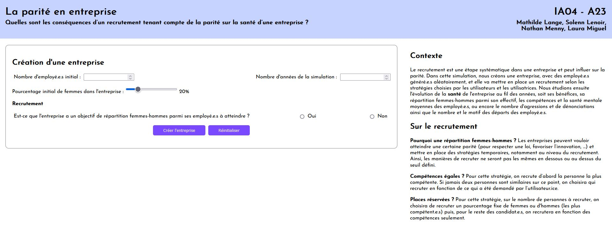
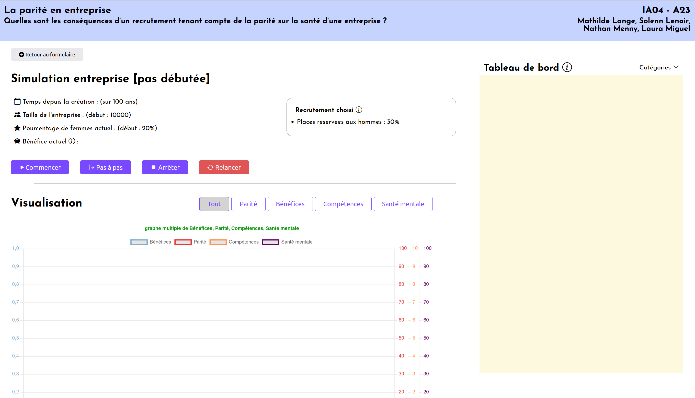
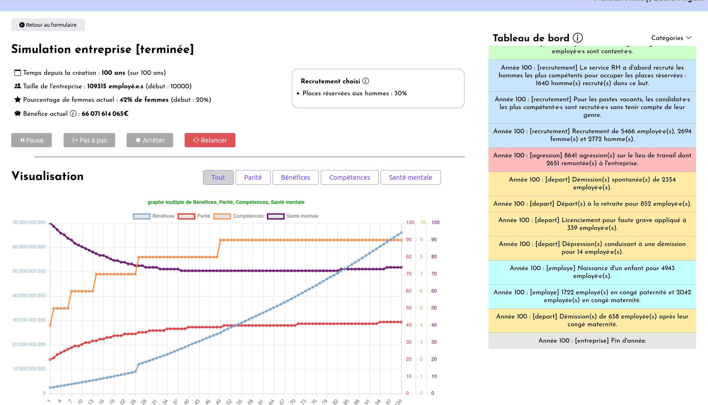

# La parité en entreprise

## Le contexte de réalisation du projet
Ce projet a été réalisé dans le cadre de l'UV IA04 enseignée à l'Université de Technologie de Compiègne. Il a été réalisé par :
* Mathilde Lange
* Solenn Lenoir
* Nathan Menny
* Laura Miguel

## Note sur l'écriture inclusive
Dans une volonté d'inclure chacun et chacune, nous avons utilisé le point médian de l'écriture inclusive dans l'interface et dans la documentation. Notre convention a été "employé·e·s", pour rendre visible le féminin et le pluriel. Cette écriture n'est pas interdite à l'UTC, et étant donné notre sujet, il nous a semblé important d'utiliser une écriture rendant visible tous les genres.

## Le sujet
Ce projet est une simulation d'une entreprise. On souhaite étudier la parité dans une entreprise. Nous nous sommes en particulier concentré·e·s sur le recrutement : c'est une étape systématique dans une entreprise qui peut influer sur la parité. Le but est donc de laisser l'utilisateur·ice choisir une façon d'effectuer son recrutement, de lancer la simulation et voir l'influence de ce recrutement sur le bénéfice de l'entreprise, le nombre de départs, etc.

## La problématique
Notre principale question est donc : quelles sont les conséquences d’un recrutement tenant compte de la parité sur la santé d’une entreprise ?

## Récupérer le projet et le lancer

Le projet peut être récupéré avec l'une des commandes suivantes : 
```bash
git clone https://gitlab.utc.fr/mennynat/ia04-project.git
ou
go get gitlab.utc.fr/mennynat/ia04-project.git
```

Ensuite, il faut récupérer toutes les dépendances du projet avec l'instruction :

```bash
go mod download
```

Enfin, le projet peut être lancé avec :

```bash
go run ./cmd/launch-all/launch-all.go
```

Il est possible de donner des arguments au script de lancement, les voici :

```
	launch-all [flags]

Les flags peuvent être :

	-h, --host nomHôte
		Indique le nom de l'hôte.
		Défaut : localhost

	-p, --port numeroPort
		Indique le port du serveur.
		Défaut : 8080

    -s 
        Lance le serveur en mode silencieux (i.e. dans la console, seuls les logs envoyés au client sont affichés)
```

Ceci va lancer un serveur web sur le port `8080` (par défaut) de le machine. Il suffit après d'accéder à l'adresse `localhost:8080` (par défaut) pour arriver sur le formulaire de création d'entreprise.

## Quelques captures du projet





## Nombre maximum d'agents testés

Afin de voir les limites de notre projet, nous avons lancé une simulation avec 10 000 _Employés_ et nous constatons que, bien que l'execution du programme soit bien ralenti, il tourne toujours (voir l'image ci-dessous). Cependant, lorsque l'on dépasse les 100 000 _Employés_ il devient vraiment difficile pour le programme d'être fluide.



N.B. : On peut noter un résultat intéressant et inattendu dans cette capture, puisque même en favorisant les hommes dans une situation où les femmes sont en minorité, le pourcentage de femmes augmente. Pour plus d'explications, voir le document [COMPLEMENTS.md](doc/COMPLEMENTS.md).

---

Des informations complémentaires sur le projet et la manière dont nous avons effectué la modélisation peuvent être trouvées dans le document [COMPLEMENTS.md](doc/COMPLEMENTS.md)
